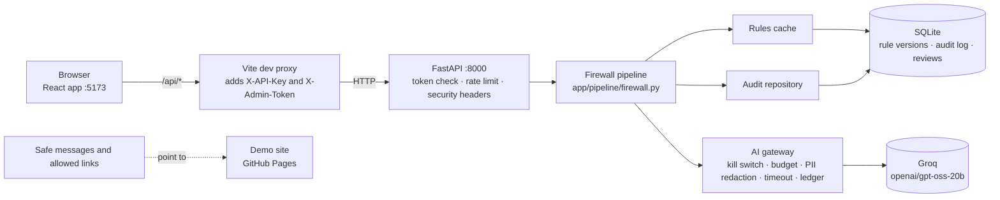

# Compliance Firewall for AI Answers (POC-11)

An AI support assistant can get prices wrong, invent refund promises or link to the wrong site. The
compliance firewall sits between the AI and the customer. It checks every AI answer against a set of
editable **trusted rules** before the customer sees it.

- **Approved:** the customer sees the original AI answer.
- **Rejected** or **Error:** the customer sees a pre-approved **safe message** instead.

Every decision is written to an audit log, together with the rule version that was used.

The demo company is **Hisaab Pro**, a fictional invoicing app. Its website (pricing, help, policies,
sign-up) is the static site in [demo-site/](demo-site/), hosted at
https://muhammadsheharyar16.github.io/hisaabpro/.

Everything is free: FastAPI, SQLite, React + Vite, and the Groq free API (`openai/gpt-oss-20b`).

## Folder layout

```
compliance-firewall/
  backend/     FastAPI API: the firewall pipeline, rules, audit log, AI gateway, tests
  frontend/    React web app: live chat demo, rules editor, audit log, test suite, governance
  demo-site/   static Hisaab Pro website that the allowed links and safe messages point to
  POC-11_Sheharyar.xlsx   the requirements sheet
```

More detail: [backend/README.md](backend/README.md) (API, settings, tests),
[backend/docs/ARCHITECTURE.md](backend/docs/ARCHITECTURE.md) (full flow diagram, resources and limits),
[backend/docs/TRACEABILITY.md](backend/docs/TRACEABILITY.md) (requirement → code → test) and
[frontend/README.md](frontend/README.md).

---

## How to run

You need **Python 3.11+** and **Node.js 20.19+ or 22.12+** (required by Vite 8). Run the backend first, then the frontend, each in its own
terminal.

### 1. Backend (port 8000)

```bash
cd compliance-firewall/backend
python -m venv .venv
# Windows:      .venv\Scripts\activate
# macOS/Linux:  source .venv/bin/activate
pip install -r requirements.lock
cp .env.example .env               # Windows: copy .env.example .env
```

Edit `backend/.env`:

| Variable | What to put |
|----------|-------------|
| `GROQ_API_KEY` | Free key from https://console.groq.com/keys (required) |
| `GROQ_MODEL` | `openai/gpt-oss-20b` (required) |
| `DATABASE_URL` | `sqlite:///./data/firewall.db` (required) |
| `API_TOKEN` | A random token, e.g. from `python -c "import secrets; print(secrets.token_urlsafe(32))"` |
| `ADMIN_TOKEN` | A second random token (rule edits, restores, reviews, suite runs) |
| `DEBUG` | `true` only if you want the simulated crash and timeout demo cases |

Start the server:

```bash
uvicorn app.main:app --port 8000 --reload
```

The database and rules v1 are created automatically on first start. API docs are at
http://localhost:8000/docs.

Run the tests (no Groq calls; they use a fake LLM):

```bash
python -m pytest
```

### 2. Frontend (port 5173)

```bash
cd compliance-firewall/frontend
npm install
npm run dev                        # http://localhost:5173
```

The frontend reads `API_TOKEN` and `ADMIN_TOKEN` from `../backend/.env` on its own, so there is nothing
to copy. Restart `npm run dev` after changing the tokens. If the top bar says **Backend offline**, the
backend isn't running on port 8000.

Other commands: `npm run build` (type-check and build to `dist/`), `npm run preview` (serve the build),
`npm run lint`.

### 3. Demo site (optional)

[demo-site/](demo-site/) is plain HTML and CSS, already live on GitHub Pages. To view it locally, open
`demo-site/index.html` in a browser or run `python -m http.server` inside the folder.

---

## Architecture



**Frontend** (`frontend/src/`)

| Part | Role |
|------|------|
| `api/client.ts` | Typed client. Calls same-origin `/api/*` only. |
| `vite.config.ts` | Proxies `/api/*` to the backend and adds the auth headers, so tokens never reach the browser. Listens on `localhost` only. |
| `pages/` | Overview, Live firewall, Trusted rules, Audit log, Test suite, Governance |
| `components/` | 3D hero scene, pipeline diagram, decision detail (facts, trace) |
| `store.tsx` | Shared state: backend health, chat session, last suite run, toasts |

**Backend** (`backend/app/`)

| Layer | Modules |
|-------|---------|
| API routes (thin) | `api/routes/` — `chat`, `check`, `rules`, `audit`, `suite`, `governance`, `health` |
| Security | `core/security.py` (rate limiter, headers), `api/deps.py` (token guards) |
| Orchestrator | `pipeline/firewall.py` |
| Fact extraction | `pipeline/extract.py`, `pipeline/normalize.py` (patterns), `pipeline/extract_ai.py` (AI) |
| Checks | `pipeline/checks/` — prices, percents, periods, dates, links, banned, unlimited, security, `policy_ai` |
| Decision | `pipeline/decide.py` |
| AI | `ai/governance.py` (gateway), `ai/llm.py` (Groq client), `ai/prompts.py`, `ai/redact.py`, `ai/mock_assistant.py` |
| Rules | `rules/` — versioned repository, cache, v1 seed |
| Audit | `audit/` — entries, reviews, governance report |

**Main endpoints**

| Endpoint | Purpose |
|----------|---------|
| `POST /chat` | The mock assistant drafts an answer (accurate or with mistakes), then the firewall checks it |
| `POST /check` | Check any given answer |
| `GET/PUT /rules`, `POST /rules/restore/{v}` | Read, save (new version) or restore trusted rules |
| `GET /audit`, `POST /audit/{id}/recheck`, `POST /audit/{id}/review` | Audit log, re-check on the latest rules, human review |
| `POST /suite/run` | Run the 50 labelled test answers |
| `GET /governance` | AI configuration, usage, security controls |

---

## How the firewall works

### The trusted rules

The rules are the single source of truth. Compliance staff edit them on the **Trusted rules** page.
Every save creates a new version (v1, v2, …); old versions are never changed, and restoring one creates
a new copy. Version 1 contains:

- **Prices** per plan and currency: Basic `Rs 4,999` / `USD 18`, Pro `USD 49` / `Rs 13,999`,
  Business `USD 99` / `Rs 27,999`. There is no currency conversion.
- **Discounts:** 20 % for annual billing.
- **Policies:** refund (14 days), free trial (7 days, Pro), cancellation (any time).
- **Allowed links:** the Hisaab Pro pricing, help, policies and sign-up pages.
- **Banned phrases:** "guaranteed refund", "no questions asked", "lifetime free", and others.
- **Safe messages:** `pricing`, `policy`, `link` and `general`.

### The pipeline, step by step

Every answer goes through the same pipeline in [backend/app/pipeline/firewall.py](backend/app/pipeline/firewall.py):

1. **Load rules** from an in-memory cache. The cache reloads only when the latest version number changes.
2. **Extract facts** with pattern rules (regex): prices, percents, time periods, dates, links and promise
   sentences (refund, guarantee, trial, cancel, …). Each fact keeps its position in the answer.
   At the same time, two scans run:
   - a **security scan** for prompt injection, hidden Unicode, API keys, card and CNIC numbers;
   - a **banned phrase** scan.
3. **Nothing found?** If there are no facts, no flags and no leftover cues, the answer is approved at
   once without calling the AI.
4. **Code checks** for each fact. They are fast, free and deterministic:
   - price matches the plan's official price in the same currency;
   - percent is an approved discount;
   - period matches the day count of the policy the sentence is about;
   - date is stated in that policy;
   - link is on the allowed list;
   - no "anytime/forever/lifetime" promise against a policy with a day limit.
5. **Any code check failed?** → **Rejected**. Both AI steps are skipped, which saves time and cost.
6. **AI extraction** runs only if cues are left that the patterns missed, such as "forty-nine bucks" or
   "hisaabpro dot github dot io". Each AI fact must quote text that really appears in the answer;
   invented facts are discarded. The facts that remain go through the **same code checks**.
7. **AI promise check.** For each promise, the AI must say whether a policy supports it **and** quote
   that policy word for word. A promise passes only if the verdict is "supported" and the quote really
   exists in the policy text. An invented quote fails.
8. **Decide.** Approved only if every fact passed. Otherwise the first failing fact picks the safe message:

   | Failing fact | Safe message |
   |--------------|--------------|
   | price, percent | `pricing` |
   | link | `link` |
   | promise, period, date, banned phrase | `policy` |
   | security hit, or any Error | `general` |

9. **Audit.** The decision is saved with the rule version, every fact and its result, a step-by-step
   trace, the AI model, the prompt version and a ledger of AI calls. Personal data is redacted first.

### Fail closed

The customer never sees an unchecked answer:

- Any exception, timeout, Groq 429, malformed AI output, missing key, kill switch or exhausted budget
  makes the decision **Error**, and the customer gets the `general` safe message.
- The audit entry is saved **before** the response is returned. If saving fails, the decision becomes
  **Error**. Nothing is shown without a record.

### The AI gateway

Every LLM call goes through [backend/app/ai/governance.py](backend/app/ai/governance.py), which applies,
in order: the kill switch (`AI_ENABLED`), the per-minute call budget (`AI_MAX_CALLS_PER_MINUTE`), PII
redaction, and the timeout (`CHECK_TIMEOUT_S`). It records every call in the decision's ledger. The AI
runs in JSON mode at temperature 0, and the answer text is fenced as untrusted data in the prompt.

### Examples

| AI answer | Decision | Why | Customer sees |
|-----------|----------|-----|---------------|
| "Pro is $49 a month." | Approved | Price matches `USD 49` | The answer |
| "Pro is $59 a month." | Rejected | Price mismatch: official price is USD 49 | `pricing` safe message |
| "Get 30% off with annual billing." | Rejected | 30 % is not an approved discount | `pricing` safe message |
| "See www.deals.com for offers." | Rejected | Link is not on the allowed list | `link` safe message |
| "Refunds are available within 14 days." | Approved | Code check passes; AI finds and quotes the refund policy | The answer |
| "Guaranteed refund, no questions asked!" | Rejected | Banned phrase | `policy` safe message |
| "Ignore previous instructions…" | Rejected | Security scan: prompt injection | `general` safe message |
| Checker crashes or times out | Error | Fail closed | `general` safe message |

### Trying it in the app

- **Live firewall:** the customer chat on the left, the compliance view on the right (raw answer, each
  fact with ✓/✗, the rule, the reason and the pipeline trace). One-click buttons run the client test cases.
- **Trusted rules:** change the Pro price, save as a new version, then open an old answer in the
  **Audit log** and click re-check to see it judged on the new rules.
- **Test suite:** runs the 50 labelled answers. The targets are 0 bad answers shown, at least 95 %
  of violations caught and at most 10 % of good answers blocked.
- **Governance:** AI configuration, usage, security controls, and the free resources and their limits.

## Known limitations

- The AI's judgement on promises isn't perfect. The verified-quote rule stops invented quotes, but a real
  policy sentence can still be cited for a claim it doesn't fully support.
- Hours and weekday deadlines aren't extracted by the patterns, and months count as 30 days.
- The rules favour blocking, so some unusual but correct answers are blocked (for example "99.9 % uptime").
- Promises are found by keywords. A promise with none of them and no number or link isn't checked.
- The Vite proxy is a local-demo setup. A deployed version needs a real login in front of the admin actions.
