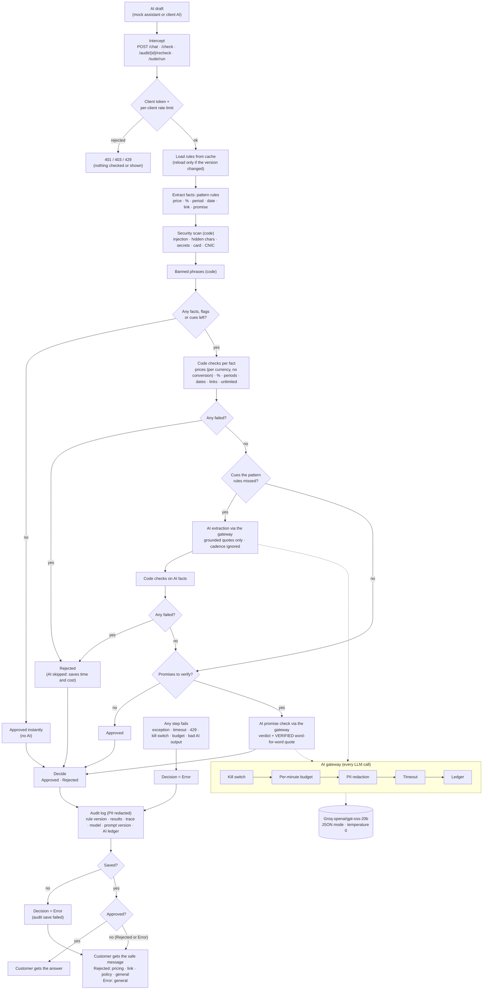

# POC-11 Compliance Firewall: architecture

## Request flow

**Fail closed.** Every step runs inside one guard. Any failure produces **Error** and the general safe
message, and the raw answer is only shown when the decision is **Approved**. The audit entry is saved
**before** anything is returned: if the save fails, the decision becomes **Error**, so nothing reaches the
customer without a record.

Errors are audited too: a failed step still produces an audit entry with decision **Error** (the sheet's
"checker crashes or times out" case). With `DEBUG=true`, `?simulate=crash|timeout` on `POST /check`
forces this path for the demo.

## Components

| Layer | Modules |
|---|---|
| API (thin routes, token guards, rate limit) | `app/api/routes/*`, `app/api/deps.py`, `app/core/security.py` |
| Orchestrator | `app/pipeline/firewall.py` |
| Pattern extraction and normalising | `app/pipeline/extract.py`, `app/pipeline/normalize.py` |
| AI extraction | `app/pipeline/extract_ai.py` |
| Code checks | `app/pipeline/checks/*.py` (prices, percents, periods, dates, links, banned, unlimited, security) |
| AI promise check | `app/pipeline/checks/policy_ai.py` |
| AI gateway, governance and privacy | `app/ai/governance.py`, `app/ai/redact.py`, `app/ai/prompts.py`, `app/ai/llm.py` |
| Rules (versioned and cached) | `app/rules/*` |
| Audit, reviews and governance report | `app/audit/*`, `app/models/*` |

## Resources and limits (demo slide)

| Resource | Tier / cost | Limit that matters | How the POC handles it |
|---|---|---|---|
| Groq API, `openai/gpt-oss-20b` | Free tier, $0 | Requests-per-minute and daily token caps on the free tier (check the Groq console for current numbers) | `AI_MAX_CALLS_PER_MINUTE` (default 25) plus a per-client rate limit. Over the limit, or on a 429, the decision is Error with a safe message. AI runs only when needed (7–9 calls for the 50-answer suite). |
| FastAPI, Uvicorn, SQLModel, pydantic | Open source, $0 | – | Pinned in `requirements.txt` and `requirements.lock` |
| SQLite (local file) | $0 | Single writer, fine for a POC | Set `DATABASE_URL` to free Postgres (Neon or Supabase) with no code change |
| Demo company site (Hisaab Pro, fictional) | GitHub Pages, $0 | Static pages only | Pricing, help, policies and sign-up pages that the allowed links and safe messages point to: https://muhammadsheharyar16.github.io/hisaabpro/ |
| Hosting | Local laptop on LAN, $0 | Plain HTTP; phone on the same Wi-Fi | For HTTPS, run uvicorn with `--ssl-keyfile/--ssl-certfile` (for example certificates from the free `mkcert`) |

**Known limitations** (for the "limitations" slide):
1. The AI model's judgement on promises is not perfect. The verified-quote rule stops invented quotes,
   but it cannot stop a real policy sentence being cited for a claim it doesn't actually support.
2. Extraction blind spots: hours and weekday deadlines aren't pattern-extracted, and months count as
   30 days.
3. Rules and fail-closed choices favour blocking. Unusual but correct answers can be blocked (for
   example "99.9 % uptime").
4. The audit log offsets refer to the original answer. Redacted stored text can be shorter.
5. Results depend on the Groq model. Live run with `openai/gpt-oss-20b` (1 Oct 2026): 0 rejected answers
   shown, 100 % of violations caught, 0 % of clean answers blocked, 9 AI calls for 50 answers. Groq can
   retire models, so re-run `POST /suite/run` after changing `GROQ_MODEL`.
6. Promises are found by keywords (refund, money back, guarantee, trial, for free, cancel, warranty).
   A promise with none of these words, and no number or link, is not checked against policy
   (for example "we never share your data").
